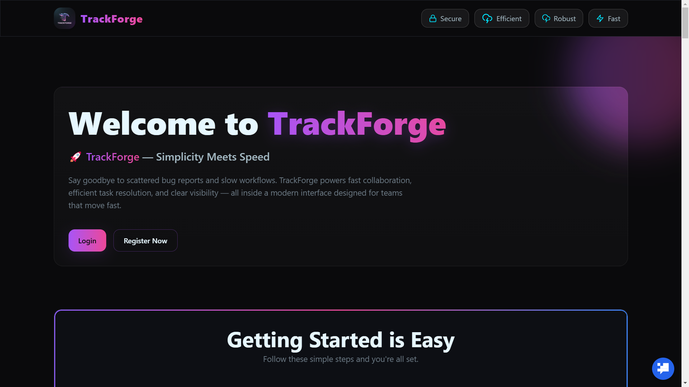
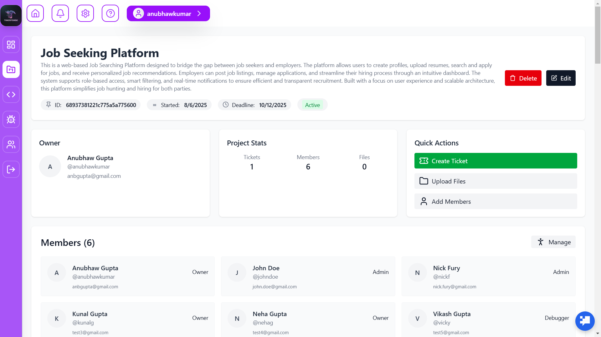
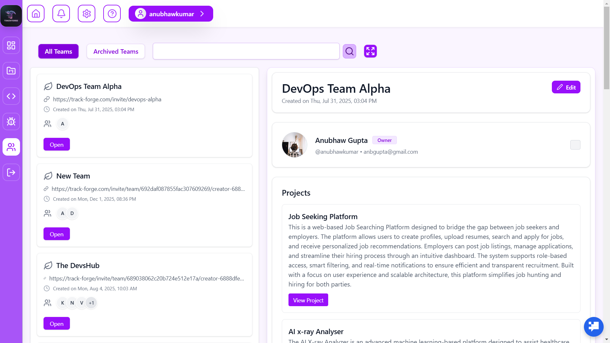
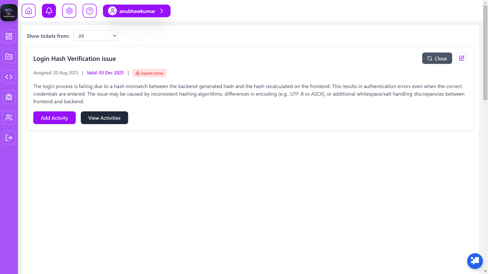

<h1 align="center">Hi 👋, I'm Anubhaw Gupta</h1>
<h3 align="center">🚀 Full Stack Developer | MERN + AI | System Thinker</h3>

  <a href="mailto:anubhawgupta664@gmail.com">Email</a> • 
  <a href="https://github.com/AnbCrafts">GitHub</a> • 
  <a href="https://linkedin.com/in/anubhaw-gupta-b35639249">LinkedIn</a>

---

## 🧠 About Me

🎓 Final-year B.Tech CSE student from Kolkata  
💻 Full Stack Developer specializing in MERN + AI integrations  
🚀 Passionate about building **real-world scalable systems**

- Strong in **OOP (C++)**, **DBMS**, and **System Design**
- Experience in **RBAC systems, API architecture, and dashboards**
- Focused on **performance, clean code, and UX clarity**

> I don’t just build apps — I build **systems that scale and solve real problems**

---

## 💼 Experience

### 🧑‍💻 Lead Full Stack Developer (Freelance)
📍 Remote | 🗓️ Jan 2025 – Present

- Led full SDLC of **EdTech + E-commerce platform**
- Built **RBAC-based architecture** for multi-role systems
- Designed scalable REST APIs & optimized DB schemas
- Delivered **admin dashboards with high usability & performance**

---

## 🚀 Projects

---

### 🔥 TrackForge – Bug Tracking & Collaboration Platform

📌 A full-scale system for managing bugs, teams, and workflows

- Role-based access (Admin / Team / Users)
- Issue tracking, comments, workflow automation
- Analytics dashboard (priority, progress, distribution)
- Future-ready architecture (GitHub sync, AI suggestions)

🛠️ Tech: React, Node.js, MongoDB, Tailwind

---

### 🤖 CodeSage – AI Code Analyzer

📌 AI-powered developer assistant

- Code explanation using LLM APIs
- Bug detection & optimization suggestions
- Real-time analysis engine

🛠️ Tech: React, Express, AI APIs

---

### 💼 FitForWork – Job Platform

📌 Recruiter + Candidate system

- Job posting + applications
- Resume handling + dashboards
- Filtering + tracking system

🛠️ Tech: MERN Stack

---

## 🎨 UI & System Design Philosophy

I focus on building **high-quality UI + strong backend logic**

### ✨ UI Principles:
- Clean, minimal, distraction-free
- Smooth animations (Framer Motion)
- Neon futuristic design (custom theme systems)
- Fully responsive (mobile-first)

### ⚙️ Backend Principles:
- Scalable architecture
- Modular API design
- RBAC-based security
- Optimized DB queries
- Clean separation of concerns

---

## 🖼️ Project UI Showcase

### 🌐 Landing & Core Pages

### 🧩 Features & Modules

### ⚙️ System & Support

---

## 🛠️ Tech Stack

### 💻 Languages
- C++, JavaScript (ES6+)

### 🌐 Frontend
- React.js, Tailwind CSS, Redux

### 🔧 Backend
- Node.js, Express.js, TypeScript

### 🗄️ Database
- MongoDB, MySQL

### ⚙️ Tools & DevOps
- Git, GitHub, Docker, Postman
- Vercel, Render
- OpenAI API, Gemini API

---

## 📊 What I Bring

✔️ Strong problem-solving mindset  
✔️ Real-world project experience  
✔️ Scalable system thinking  
✔️ Clean, maintainable code  
✔️ Fast learner + execution-focused  

---

## 📫 Contact Me

📧 Email: **anubhawgupta664@gmail.com**  
🔗 GitHub: https://github.com/AnbCrafts  
💼 LinkedIn: https://linkedin.com/in/anubhaw-gupta-b35639249  

---

## ⚡ Fun Fact

I enjoy turning **complex problems into clean, scalable systems** —  
and making them look 🔥 while doing it.

---
