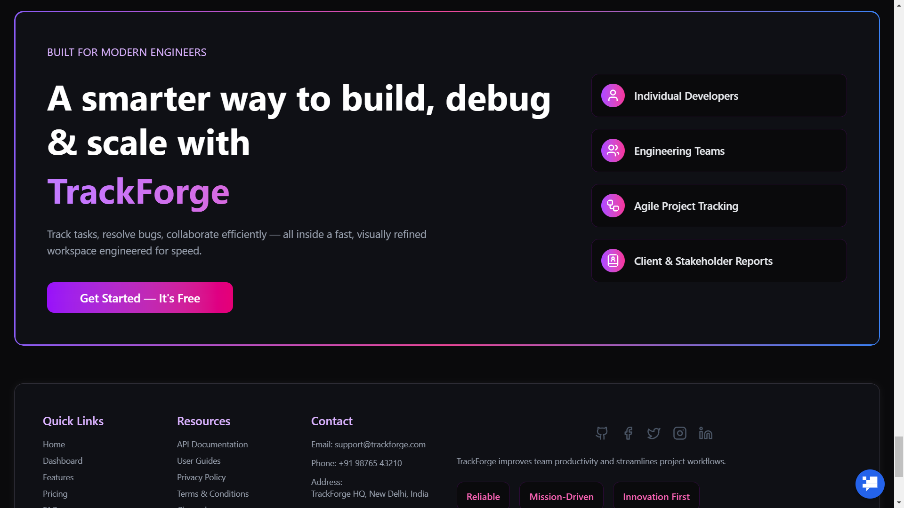
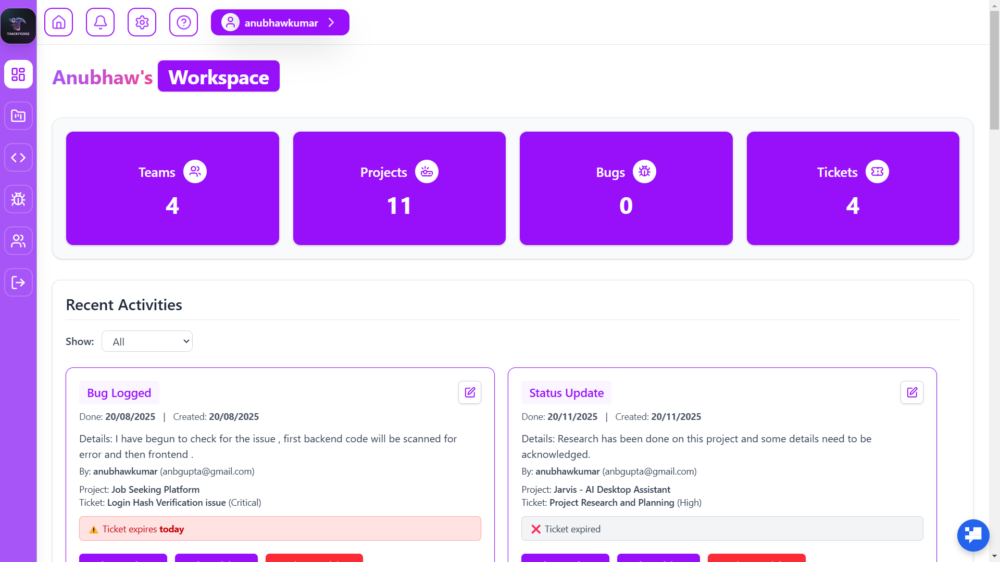

# 🚀 Anubhaw Kumar Gupta | Full-Stack Engineer

Welcome to my digital workshop\! [cite_start]I am a final-year B.Tech CSE student [cite: 5, 38] [cite_start]and a passionate **Full-Stack Developer** specializing in the **MERN stack**[cite: 5, 12]. [cite_start]I build scalable, high-performance web applications that bridge the gap between complex backend logic and intuitive user experiences[cite: 6, 8].

-----

## 👨‍💻 About Me

  * [cite_start]**Current Focus:** Final-year B.Tech Engineering student at JIS University (Class of 2026)[cite: 5, 38].
  * [cite_start]**Mission:** Building real-world solutions that optimize systems for reliability and peak performance[cite: 8].
  * [cite_start]**Journey:** From being a **College Topper** with a 91.2% in Higher Secondary [cite: 40] [cite_start]to spearheaded end-to-end SDLCs for e-commerce and EdTech platforms as a Lead Developer[cite: 11, 12].
  * [cite_start]**Philosophy:** Driven by clean code, modular architecture, and emerging AI technologies[cite: 8, 14, 19].

-----

## 🛠️ Technical Arsenal

| Category | Technologies |
| :--- | :--- |
| **Languages** | [cite_start]C++, JavaScript (ES6+), TypeScript [cite: 40] |
| **Frontend** | [cite_start]React.js, Redux, Tailwind CSS, HTML5, CSS3 [cite: 40] |
| **Backend** | [cite_start]Node.js, Express.js, RESTful APIs [cite: 40] |
| **Database** | [cite_start]MongoDB, SQL, MySQL [cite: 40] |
| **DevOps & Tools** | [cite_start]Docker, Docker Compose, Git/GitHub, N8N, Postman [cite: 40] |
| **AI Integration** | [cite_start]OpenAI API, Gemini API, Grok AI [cite: 19, 40] |

-----

## 💼 Professional Experience

### **Lead Full Stack Developer (Freelance/Contract)**

[cite_start]*Jan 2025 – Present* [cite: 11]

  * [cite_start]**Architected** secure RESTful APIs and optimized database schemas with complex **Role-Based Access Control (RBAC)**[cite: 13].
  * [cite_start]**Led** a development team through the full SDLC of a scalable EdTech & E-commerce platform[cite: 12].
  * [cite_start]**Engineered** high-performance administrative dashboards using React.js and Tailwind CSS to streamline client workflows[cite: 15].

-----

## 🏗️ Featured Projects

### 🧠 **CodeSage — AI Code Analysis Tool**

[cite_start]*An AI-assisted platform for real-time code breakdown and optimization.* [cite: 17, 19]

  * [cite_start]**Logic:** Orchestrated an Express.js backend to handle complex code-parsing logic and Grok AI API calls[cite: 21].
  * [cite_start]**UI:** Developed a responsive React frontend focused on smooth interactions and logical flow breakdowns[cite: 20, 22].

### 🐞 **TrackForge — Bug Tracking & Collaboration**

[cite_start]*A scalable platform for project insights and task management.* [cite: 24, 26]

  * [cite_start]**Logic:** Built a modular backend supporting granular RBAC, threaded comments, and automated workflow updates[cite: 27, 30].
  * [cite_start]**UI:** Designed professional analytics dashboards for issue distribution and priority metrics using Tailwind CSS[cite: 28, 29].

### 💼 **FitForWork — Job Hunting Ecosystem**

[cite_start]*A dual-role platform for recruiters and candidates.* [cite: 31, 33]

  * [cite_start]**Logic:** Implemented intelligent job filtering and secure MongoDB/Express architecture for robust data validation[cite: 34].
  * [cite_start]**UI:** Optimized for cross-device usage (mobile/desktop) with a focus on streamlined hiring workflows[cite: 34, 35].

-----

## 🖼️ Interface Gallery

*Visual overview of my project architectures and UI designs:*

\

\
\
\
\</p\>

\<details\>
\<summary\>\<b\>View More Components\</b\>\</summary\>

  * **Core Logic:** `login.png`, `notification.png`, `teams.png`
  * **Feature Modules:** `bugs.png`, `project.png`, `pricing.png`
  * **Recruitment Suite:** `recruiters.png`, `companies.png`, `steps.png`

\</details\>

-----

## 🏆 Achievements

  * [cite_start]**Best Performer:** Selected in NPTEL Java Programming course at JIS University (2024)[cite: 40].
  * [cite_start]**Hackathon Finalist:** Participated in the 36-hour Hack-O-Nova Inter-College Hackathon at Adamas University (2024)[cite: 40].
  * [cite_start]**Academic Excellence:** College Topper in Higher Secondary (91.2%)[cite: 40].

-----

## 📫 Let's Connect\!

  * [cite_start]**Email:** [anubhawgupta664@gmail.com](mailto:anubhawgupta664@gmail.com) [cite: 2]
  * [cite_start]**LinkedIn:** [in/anubhaw-gupta-b35639249](https://www.google.com/search?q=https://linkedin.com/in/anubhaw-gupta-b35639249) [cite: 2]
  * [cite_start]**GitHub:** [AnbCrafts](https://www.google.com/search?q=https://github.com/AnbCrafts) [cite: 3]
  * [cite_start]**Location:** Kolkata, West Bengal, India [cite: 2]

-----

*Generated with ❤️ by Anubhaw Kumar Gupta | © 2026*